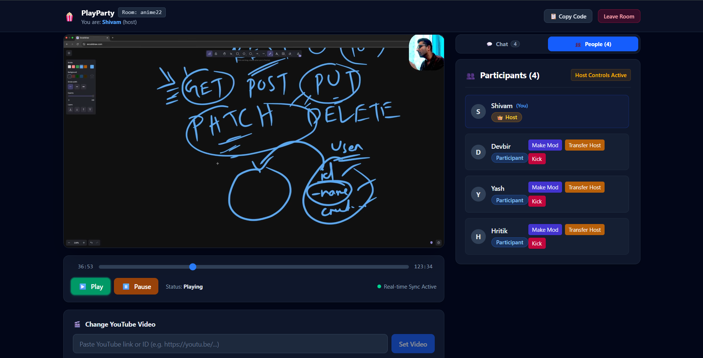
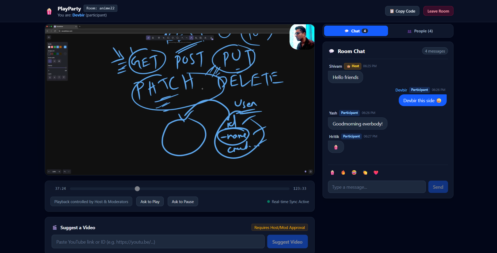
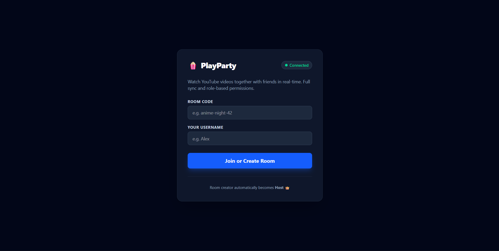

# PlayParty 🎉

[](https://reactjs.org/)
[](https://vitejs.dev/)
[](https://tailwindcss.com/)
[](https://nodejs.org/)
[](https://expressjs.com/)
[](https://socket.io/)
[](https://www.mongodb.com/)
[](https://mongoosejs.com/)
[](https://tanstack.com/query/latest)

---

## 📖 Overview
PlayParty is a real‑time, browser‑based party application that lets a **Host** stream a YouTube video to multiple **Participants** while enabling **Moderators** to assist with playback control and chat moderation. All participants can chat, see who is in the room, and request actions such as play/pause or changing the video.

---

## 🚀 Problem Statement & Solution
**Problem:** Coordinating video playback and communication for remote gatherings is messy – users end up on separate tabs, manually syncing playback, and lack a unified chat.

**Solution:** PlayParty provides a single page where the host controls a YouTube embed via the IFrame Player API, while participants watch the synchronized stream and interact through a live chat. Role‑Based Access Control (RBAC) ensures only authorized users can perform privileged actions.

---

## ✨ Key Features
- **RBAC** – Host, Moderator, Participant roles with fine‑grained permissions.
- **Real‑time video sync** – Play, pause, seek, and video change are instantly reflected for all users.
- **Custom YouTube controls** – Native YouTube UI hidden; custom play/pause, scrubber, and status label.
- **Live chat** – Text chat with role badges, emojis, and auto‑scroll.
- **Participant list** – Shows usernames and roles; host can promote/demote, transfer host, or kick.
- **Action requests** – Participants can request playback changes; moderators and host approve via toast notifications.
- **Tailwind CSS UI** – Responsive, modern design.
- **TanStack Query** – Efficient data fetching & caching.
- **MongoDB persistence** – Room state and participant info stored in Atlas.

---

## 🛠️ Tech Stack
### Frontend
| Technology | Version | Why we use it |
|---|---|---|
| React | 18.2.0 | Component‑driven UI, fast re‑rendering |
| Vite | 5.2.0 | Lightning‑fast dev server & bundling |
| Tailwind CSS | 3.4.0 | Utility‑first styling, responsive design |
| TanStack Query | 5.40.0 | Declarative data fetching & caching |
| Socket.io‑client | 4.7.5 | Real‑time bi‑directional communication |

### Backend
| Technology | Version | Why we use it |
|---|---|---|
| Node.js | 20.14.0 | Scalable, event‑driven server |
| Express | 4.19.2 | Minimalist HTTP server & routing |
| Socket.io (server) | 4.7.5 | Real‑time synchronization |
| Mongoose | 8.2.0 | ODM for MongoDB, schema validation |

### Database
| Technology | Version | Why we use it |
|---|---|---|
| MongoDB Atlas | 7.x | Fully managed, flexible document store |


---

## 🏗️ Architecture / Folder Structure
```
PlayParty-MERN-SocketIO/
├─ client/                # React front‑end
│   ├─ src/
│   │   ├─ components/   # UI components (YoutubePlayer, ChatBox, …)
│   │   ├─ hooks/        # TanStack Query hooks
│   │   └─ App.jsx
│   └─ index.html
├─ server/                # Node/Express back‑end
│   ├─ controllers/      # Socket.io event handlers
│   ├─ models/           # Mongoose schemas (Room, Participant)
│   └─ server.js
├─ .env.example           # Environment variable template
└─ README.md              # **This file**
```

---

## ⚙️ Setup & Run Instructions
1. **Clone the repository**
   ```bash
   git clone <repo_url>
   cd PlayParty-MERN-SocketIO
   ```
2. **Create an `.env` file** (copy from `.env.example`). Provide:
   - `MONGODB_URI` – MongoDB Atlas connection string
   - `PORT` – Backend port (default 5000)
   - `CLIENT_URL` – Front‑end URL (e.g., `http://localhost:5173`)
3. **Install dependencies**
   ```bash
   # Backend
   cd server && npm install && cd ..
   # Frontend
   cd client && npm install && cd ..
   ```
4. **Run the development servers**
   ```bash
   # Terminal 1 – Backend
   cd server && npm run dev   # or `node server.js`

   # Terminal 2 – Frontend
   cd client && npm run dev
   ```
5. Open `http://localhost:5173` in your browser, create a room, and share the URL with participants.

**Production build**
```bash
# Build client
cd client && npm run build
# Start server (serve built assets if desired)
cd ../server && npm start
```

---

## 📸 Screenshots (placeholders)
<!-- Screenshot: Host view -->


<!-- Screenshot: Participant view -->


<!-- Screenshot: Join‑room interface -->


---

## 🌐 Live Demo
<!-- Live URL placeholder -->
[Live URL pending]

---

*Happy playing!*
